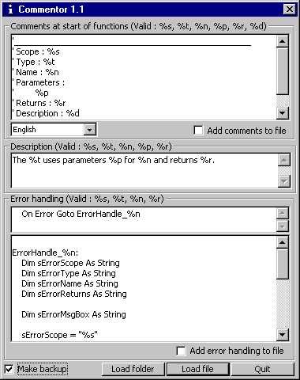



## Commentor 1\.1

### Description

Comments and adds error handling to your projects
 
### More Info
 
Could have an error with w3ird coding, but codes always makes backups of files

             |
---                |---
**Submitted On**   |2000-10-11 11:06:40
**By**             |[Jean\-Philippe Leconte](https://github.com/Planet-Source-Code/PSCIndex/blob/master/ByAuthor/jean-philippe-leconte.md)
**Level**          |Intermediate
**User Rating**    |4.0 (8 globes from 2 users)
**Compatibility**  |VB 5\.0, VB 6\.0
**Category**       |[Debugging and Error Handling](https://github.com/Planet-Source-Code/PSCIndex/blob/master/ByCategory/debugging-and-error-handling__1-26.md)
**World**          |[Visual Basic](https://github.com/Planet-Source-Code/PSCIndex/blob/master/ByWorld/visual-basic.md)
**Archive File**   |[CODE\_UPLOAD1096410262000\.zip](https://github.com/Planet-Source-Code/jean-philippe-leconte-commentor-1-1__1-12307/archive/master.zip)

